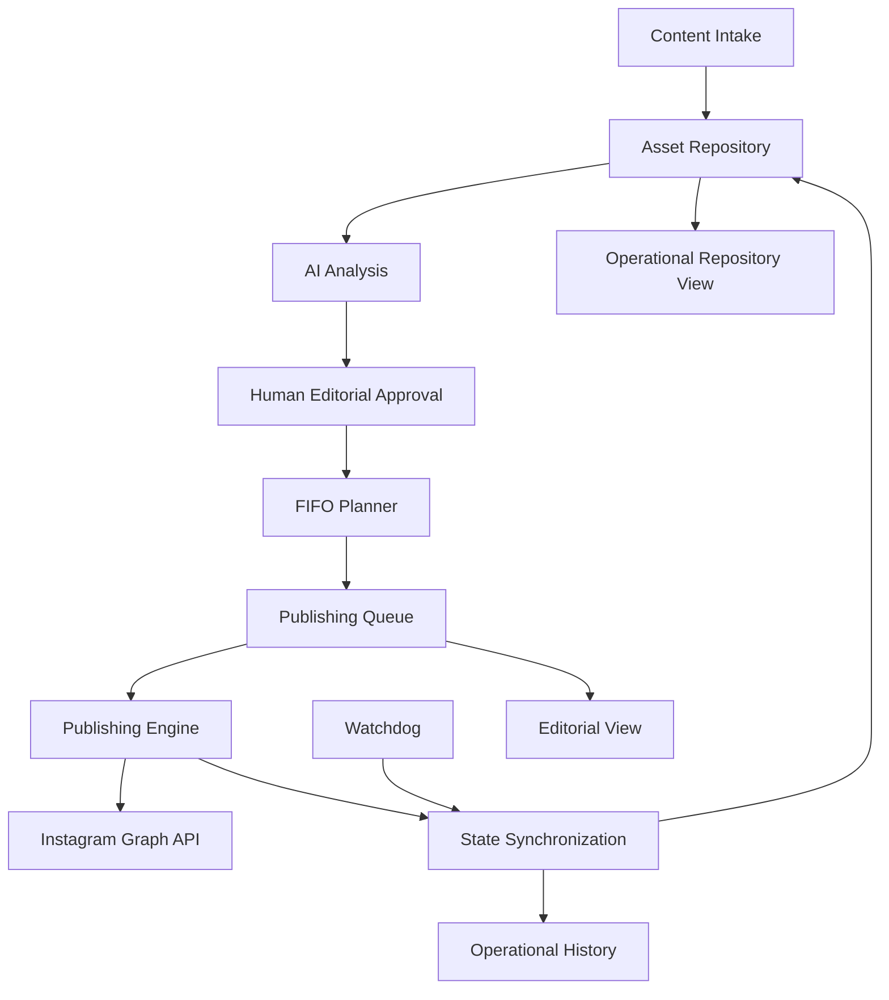

# AI-Assisted Content Operations & Publishing Automation

A product case about designing and building a reliable content operations system with AI-assisted analysis, human approval, automated planning, publishing, synchronization, observability and recovery.

> **Status:** V1 production-frozen
> **Development:** ~5 weeks of part-time iterative work alongside other professional projects
> **Role:** Product Builder · Automation Designer · Product/System Designer

---

## What I built

What started as an Instagram publishing automation evolved into a broader **Content Operations system**:

```text
Content Intake
    ↓
Asset Repository
    ↓
AI Analysis
    ↓
Human Approval
    ↓
FIFO Planner
    ↓
Publishing Queue
    ↓
Instagram Publishing
    ↓
State Synchronization
    ↓
Watchdog + History + Operational Views
```

The product combines workflow orchestration, AI, state management, external APIs and release/reliability practices.

---

## Why this is more than an automation

The system includes:

- persistent operational state;
- multiple workflow triggers;
- AI-assisted analysis;
- human-in-the-loop editorial approval;
- FIFO scheduling;
- multi-format publishing;
- synchronization between operational datasets;
- watchdog/reconciliation;
- operational panels and history;
- execution retention;
- backup and recovery;
- release gates and frozen baselines.

---

## Architecture



---

## Technology

### Product
- n8n
- JavaScript
- SQLite
- Gemini
- Instagram Graph API
- Cloudinary
- REST / HTTP
- Webhooks
- JSON
- Cron / schedules

### Runtime & development
- Docker
- Ubuntu / WSL2
- Windows
- terminal-based release tooling

### Reliability
- health checks
- watchdog/reconciliation
- state invariants
- SQLite integrity checks
- SHA-256 baselines
- smoke tests
- controlled backup
- restart/recovery validation
- release freeze

---

## Key product principles

- **Human in the loop:** AI supports editorial analysis but does not autonomously approve publication.
- **Persistent state:** critical state survives restarts.
- **Idempotency:** repeated execution should not create duplicated operational effects.
- **Publication immutability:** published content is treated as consumed history.
- **State coherence:** queue and asset repository must remain aligned.
- **Observability:** the system must make its operational state inspectable.
- **Recovery:** temporary failure or restart must not corrupt state.
- **Auditable release:** the production baseline is validated before freeze.

---

## Reliability work

The V1 was frozen only after validating:

- workflow baseline integrity;
- active/inactive workflow inventory;
- orphan webhook cleanup;
- queue ↔ repository consistency;
- slot uniqueness;
- consumed-slot protection;
- publication immutability;
- overdue detection;
- recent execution health;
- stale execution absence;
- endpoint readiness;
- restart/recovery;
- backup integrity.

The release claim is intentionally:

> **zero known defects + all critical invariants PASS + final adversarial release suite PASS**

Not “bug free”.

---

## Main engineering lessons

A few issues materially changed the architecture:

1. **Database growth was structural, not cache-related.**
   Execution retention, polling, payload history and old workflows accumulated operational cost.

2. **A correct UI does not guarantee correct state.**
   One planner defect was visible only by inspecting the underlying queue state.

3. **Schedulers need consumed-history awareness.**
   A published time slot must not become available again just because the current queue no longer occupies it.

4. **An auditor can be wrong.**
   A false finding happened because the relation between queue and repository was modeled incorrectly.

5. **Health is not always readiness.**
   After restart, the application health endpoint recovered before all functional routes were ready.

6. **Test harnesses also require engineering discipline.**
   Harness errors were explicitly separated from product defects.

---

## Case study

Start here:

- [Full Product Case](docs/index.md)
- [System Architecture](docs/architecture.md)
- [Workflow Architecture](docs/workflows.md)
- [Data & State Model](docs/data-model.md)
- [Reliability & Release](docs/reliability.md)
- [Timeline](docs/timeline.md)
- [Learning Roadmap](docs/learning-roadmap.md)
- [Future Product Roadmap](docs/future-roadmap.md)

---

## Repository scope

This repository is a **sanitized public case study**.

It intentionally does **not** contain:

- production credentials;
- API tokens;
- account identifiers;
- production databases;
- private URLs;
- real operational data;
- raw execution dumps;
- production webhook identifiers;
- unreviewed workflow exports.

See [SANITIZATION.md](SANITIZATION.md).

---

## Portuguese summary

Este repositório documenta um sistema de operações de conteúdo assistido por IA, desenvolvido como produto interno e congelado em uma V1 após auditoria de arquitetura, dados, confiabilidade, recovery e release.

O objetivo do repositório é demonstrar **Product Thinking + Automation Engineering + AI Systems + Reliability**, sem expor dados ou infraestrutura de produção.
