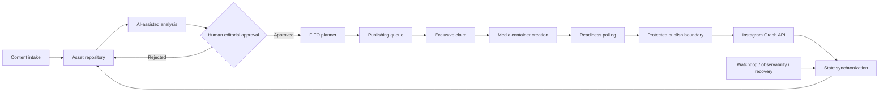

# AI-Assisted Content Operations & Publishing Automation

A product case study about building a reliable content operations system: AI-assisted analysis, human approval, FIFO planning, external publishing, state synchronization, observability and recovery.

**Role:** Product Builder · Automation Designer · Product/System Designer 
**Scope:** V1 operational release · production-validated canary · ~5 weeks of part-time iterative work

## System flow

The system keeps editorial judgment with a person, while persistent operational state connects the specialized workflows that plan, publish, reconcile and recover content.

## What I built

An orchestration system for taking content from intake to publication and back into a trustworthy operational state. It combines:

- AI-assisted content analysis;
- human approval and rejection;
- FIFO scheduling and publishing queues;
- multi-format publishing through the Instagram Graph API;
- synchronization between the asset repository and queue;
- watchdog, reconciliation and recovery paths.

The public repository is a case study of the product and its release decisions, not a deployable production export.

## Why this is more than an automation

The hard part was not connecting services. It was defining what the system could safely believe after each state transition — especially when local state and an irreversible external API cannot commit atomically.

That led to a deliberate reliability model: exclusive local ownership, duplicate-risk reduction, protected terminal states, no blind republish after an ambiguous external outcome, and human exception handling when the evidence is incomplete.

Exactly-once delivery is not claimed.

## Reliability decisions that shaped V1

- **M2 — Exclusive claim:** a publisher claims an item and rechecks ownership before the external boundary.
- **M3 — External outcome handling:** confirmed success is synchronized; deterministic rejection is recorded without blind republish; ambiguity is protected from automatic retry and requires human reconciliation.
- **M4 — State terminality:** late branches cannot downgrade published, protected or externally ambiguous states.
- **WF05E ownership:** the planner uses a fail-closed allowlist and mutates only explicitly plannable states.
- **WF07 isolation:** reconciliation isolates malformed relations per item so unrelated valid items continue.

The release also included readiness polling, retention and read-pattern improvements, health checks, backup, restart/recovery validation and a frozen baseline. The detailed design is documented in [Reliability & Release](docs/reliability.md) and [System Architecture](docs/architecture.md).

## Production canary

The final release included a clean real production canary. The checks below are intentionally summarized at aggregate level; no operational identifiers or raw evidence are published.

| Check | Result |
| --- | --- |
| Planning | Pass |
| Exclusive claim | Pass |
| Creation-ID preservation | Pass |
| Media publish count | 1 |
| Duplicate publication | No |
| State flow and terminality | Pass |
| Final queue state | `PUBLISHED` |
| Final repository state | `PUBLISHED` |
| Synchronization | Pass |
| Post-publish planner immutability | Pass |
| Global inconsistencies | 0 |

Release closure

The release closure recorded `GATE_Z=PASS`, `V1_OPERATIONAL_RELEASE=PASS` and `V1=COMPLETE`. It also recorded `KNOWN_CRITICAL_DEFECTS=0`, `FUNCTIONAL_BLOCKERS=0` and `OPEN_TECH_DEBT=0`; this is not a claim that the system was bug-free.

## Case study navigation

- [Full Product Case](docs/index.md) — context, product definition, lessons and outcome
- [System Architecture](docs/architecture.md) — layers, boundaries and reliability model
- [Workflow Architecture](docs/workflows.md) — workflow responsibilities and public structure
- [Data & State Model](docs/data-model.md) — operational datasets and invariants
- [Reliability & Release](docs/reliability.md) — validation, recovery and V1 closure
- [Timeline](docs/timeline.md) — iterative development history
- [Future Product Roadmap](docs/future-roadmap.md)
- [Learning Roadmap](docs/learning-roadmap.md)

## Repository scope

This is a sanitized public case study. It contains no credentials, tokens, private identifiers, databases, raw execution payloads, private URLs, customer content or production workflow exports. Public workflow files are structure-only representations. See [SANITIZATION.md](SANITIZATION.md), [SECURITY.md](SECURITY.md) and [PUBLISHING_CHECKLIST.md](PUBLISHING_CHECKLIST.md).

## Resumo em português

Este repositório documenta um sistema de operações de conteúdo assistido por IA, com aprovação humana, planejamento FIFO, publicação, sincronização, observabilidade e recuperação. A V1 foi validada em produção e concluída como release operacional, sem expor dados ou infraestrutura privada.
