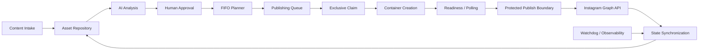

# System Architecture

## Functional architecture

## Layers

- **Experience:** intake, repository, editorial approval, operational views and history.
- **Orchestration:** eleven specialized n8n workflows, schedules, webhooks and subworkflows.
- **Intelligence:** AI-assisted classification and analysis; humans own the decision.
- **State:** queue, asset repository, planner events and execution metadata.
- **External boundary:** media preparation and Instagram Graph API publication.
- **Reliability:** claims, readiness polling, terminality guards, reconciliation, health checks, backup and release freeze.

The local state store and irreversible external API do not form one atomic transaction. The publisher persists `meta_creation_id`, claims exclusive ownership, attempts external publish once, and quarantines ambiguity rather than guessing or retrying unsafely. Public workflow files are structure-only representations, not production exports.
