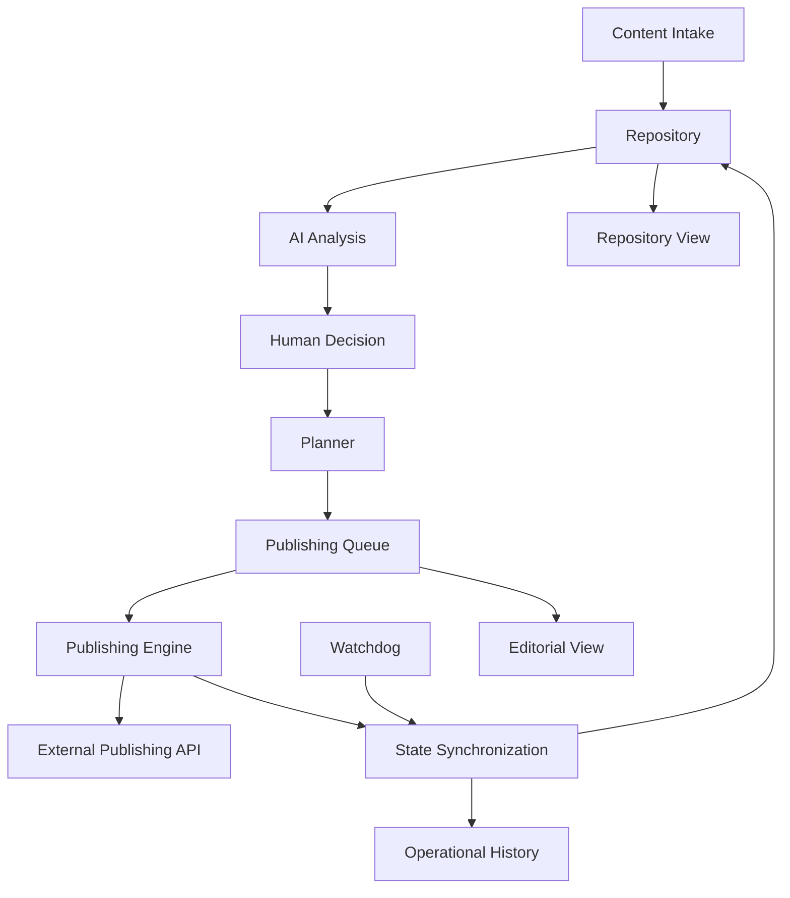

# System Architecture

## Functional architecture

## Layers

### Experience / Operations
- content intake form;
- repository view;
- editorial view;
- history.

### Orchestration
- n8n;
- triggers;
- schedules;
- webhooks;
- reusable subworkflows.

### Intelligence
- Gemini-based analysis.

### Data
- SQLite;
- queue;
- asset repository;
- workflow/execution metadata.

### External services
- Instagram Graph API;
- Cloudinary.

### Reliability
- watchdog;
- synchronization;
- state invariants;
- execution retention;
- health checks;
- backup;
- recovery;
- release baseline.

## Architectural idea

The product should not be understood as eleven independent automations.

It is a stateful orchestration system where workflows are specialized components connected through persistent operational data.
