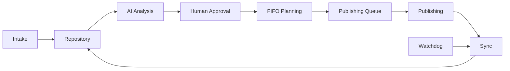

# Product Case Study
## AI-Assisted Content Operations & Publishing Automation

## 1. Context

The initial goal was simple: reduce manual work involved in publishing content.

But once the workflow had to operate repeatedly and reliably, the real problem became larger.

The system needed to answer:

- Where does content enter?
- Where is it stored?
- How is AI used without removing human editorial control?
- How is approved content scheduled?
- How are publishing slots protected?
- How is publication confirmed?
- How does the asset repository stay synchronized?
- What happens after temporary failures?
- How can the operator inspect the current state?
- How can the product recover after restart?

That shifted the project from a simple workflow to an operational product.

---

## 2. Product definition

> A content operations orchestration system with AI-assisted analysis, human editorial approval, automated planning, publishing, synchronization, observability and recovery.

---

## 3. My role

I worked across:

- problem definition;
- system and product architecture;
- workflow design;
- state modeling;
- AI integration;
- API integration;
- automation implementation;
- testing;
- debugging;
- observability;
- release validation.

The role sits at the intersection of:

**Product Design + Systems Thinking + Automation Engineering + AI Product Building.**

---

## 4. Core flow



---

## 5. Human + AI model

The AI does not own the final editorial decision.

```text
AI analyzes
    ↓
Human reviews
    ↓
Human approves/rejects
    ↓
Planner becomes eligible to schedule
```

This design keeps automation speed while preserving accountability.

---

## 6. Planning

The planner became one of the most critical product components.

It needed to:

- schedule approved content;
- preserve occupied slots;
- respect publication history;
- prevent duplicate active slots;
- prevent already-consumed slots from being reused;
- keep queue/repository state coherent.

A real defect exposed an important principle:

> Current occupancy is not enough. A scheduler must also understand consumed history.

---

## 7. Data model

Two operational datasets form the core:

### Publishing Queue
Represents scheduled/publishing state.

### Asset Repository
Represents content lifecycle and editorial state.

A canonical content key links both.

This relationship became a formal release invariant.

---

## 8. Reliability

Reliability was designed around:

- state persistence;
- controlled execution retention;
- reconciliation;
- watchdog;
- integrity checks;
- smoke tests;
- restart validation;
- baseline hashing;
- backup;
- release freeze.

---

## 9. A major operational lesson: database growth

The SQLite database historically grew to tens of gigabytes.

The problem was structural:

- retained executions;
- large payload history;
- frequent polling;
- broad reads;
- obsolete workflow history.

The solution was not “clear the cache”.

It required:
- retention changes;
- read-pattern improvements;
- workflow cleanup;
- production baseline control.

---

## 10. Adversarial validation

Before freeze, the product went through several validation layers:

```text
Publishing Engine
→ UI
→ Planner
→ Cleanup
→ Static Architecture
→ Data Invariants
→ Release Read-only Audit
→ Restart / Recovery
→ Backup / Freeze
```

The final release had zero known critical defects, zero functional blockers and zero open technical debt after the suite. This does not mean “bug free”.

The clean real production canary then confirmed planning, exclusive claim, creation-ID preservation, one media publish, no duplicate publication, state flow, terminality, synchronization and post-publish planner immutability. Both final projections were `PUBLISHED`; global inconsistencies were `0`.

## 11. V1 closure

`GATE_Z=PASS` · `V1_OPERATIONAL_RELEASE=PASS` · `V1=COMPLETE`.

The main iterations were driven by real findings: carousel cardinality, concurrent ownership, ambiguous external outcomes, terminality, environment binding, semantic `meta_creation_id`, planner state ownership and per-item watchdog isolation.

---

## 12. Outcome

V1 ended with:

- 11 production workflows;
- persistent operational data;
- AI-assisted content analysis;
- human editorial approval;
- automatic planning;
- multi-format publishing;
- state synchronization;
- watchdog/reconciliation;
- operational views;
- release evidence;
- restart/recovery validation.

---

## 13. Development timeline

The first recovered project evidence is from late July 2026.

The production-frozen V1 was completed in early September 2026.

Portfolio wording:

> **Built iteratively over ~5 weeks alongside other professional projects.**

This was not five weeks of full-time dedicated work.

---

## 14. What this project taught me

The biggest learning was not n8n itself.

It was learning how to:

- frame an open-ended problem;
- turn it into system behavior;
- define states and invariants;
- integrate AI without removing human control;
- inspect operational truth instead of trusting only the UI;
- distinguish product defects from test-harness defects;
- improve reliability from real failure evidence;
- freeze a production baseline intentionally.

---

## 15. Where this can go next

Possible future products include:

- multi-channel publishing;
- custom frontend;
- multi-brand workspaces;
- AI creative operations;
- analytics and recommendation loops;
- commercial starter kit.

See [Future Product Roadmap](future-roadmap.md).

---

## 16. Professional development

This project also created a concrete study path:

- Automation Engineering;
- JavaScript / TypeScript;
- Node.js;
- SQL;
- testing;
- Docker / Compose;
- Git / CI/CD;
- AI evaluation;
- observability;
- cloud deployment.

See [Learning Roadmap](learning-roadmap.md).
